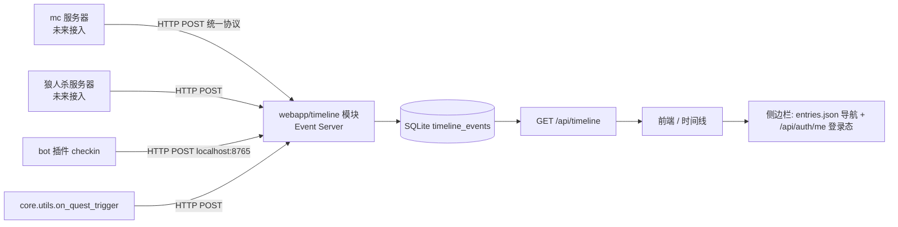

# 社区时间线设计（2026-08-10）

> 权威协议见 [`specs/timeline-protocol.md`](../../specs/timeline-protocol.md)（本设计与之一致，冲突以 spec 为准）。
> 状态：设计已收敛，待实施。实施任务清单见本文「实施任务清单」；实施阶段在 `docs/archive/superpowers/plans/` 建立逐任务计划。

## 背景与目标

小站各功能相互独立，用户缺少持续访问的理由。目标是建设一个**社区基础设施**：把朋友之间各种数字活动连接成共同记录，以网页时间线作为社区主页，展示「谁做了什么」。

时间线本身不是功能，它是**功能的入口**——卡片可跳转到对应功能页面。

## 决策记录（本次讨论收敛）

| # | 决策 |
|---|---|
| 1 | 时间线登录可看；主页 `/` 同样登录后才能访问（全站门禁） |
| 2 | 主页 `/` 直接是时间线，**无限滚动动态加载**；不做 `/timeline` 全量页、不做「最近 1 天」页面级截断 |
| 3 | 什么值得上时间线由**发送方决定**（所有系统自研，粒度可控）；Event Server 不做速率限制 |
| 4 | 撤回 = **硬删除**；业务回滚（撤回打卡等）必须联动删除对应事件 |
| 5 | 协议**无 icon 字段** |
| A | `display.title/description` 支持 `{id:<user_id>}` 占位符，接收方渲染时解析为头像+昵称 |
| B | **无 timestamp 字段**；服务器收件时打 `received_at`，展示、排序均以此为准 |
| C | `target.url` 存在与否决定是否渲染「>>详情」按钮；`target.type` 仅自由标签 |
| D | `actor = {id, qq?}`；外部系统发自己的用户 id，接收方解析绑定；未绑定显示「未绑定玩家」 |
| E | 布局：Twitter 式——侧边栏（功能导航 + 登录状态）+ 中间时间线流 |

## 架构



- **Event Server = `webapp/timeline/` 模块**（webapp 第 8 个模块），不是独立进程。单进程 + 共享 SQLite 复用现有模式，无新部署。
- **所有发送方统一走 HTTP POST**，不走共享 SQLite 直写——单一接入契约，未来 Event Server 独立成进程仅换 URL，发送方零改动。
- **发送 best-effort**：失败只记日志，绝不阻塞机器人主流程（线程模型关键约束）。
- 发送方认证：`Authorization: Bearer <BOTERO_EVENT_TOKEN>`（与用户登录密钥**不同**，是系统间共享密钥，写入 `scripts/botero.env`，bot 与 webapp 均已加载该文件）。

## 事件协议摘要

详见 [`specs/timeline-protocol.md`](../../specs/timeline-protocol.md)，要点：

```json
POST /api/timeline/events      # Authorization: Bearer <BOTERO_EVENT_TOKEN>
{
  "id": "checkin:3f2a…",                 // 客户端生成 <source>:<uuid>；(source,id) 唯一 → 幂等
  "source": "checkin",
  "actor": { "id": "123456", "qq": "123456" },
  "target": { "type": "url", "url": "https://…" },   // url 存在 → >>详情
  "display": {
    "title": "{id:123456} 完成打卡",
    "description": "本周第 5 天"
  },
  "data": {},
  "dedup_key": "checkin:123456:2026-08-10"  // 可选，业务自然键
}
```

无 `timestamp`（服务器打 `received_at`）、无 `icon`；`{id:}` 占位符只接受 QQ 号。

## 存储

`core/db/_base.py::init_schema` 新增表，`core/db/timeline.py` 新增 `TimelineManager`，`DbManager` 挂载 `self.timeline`：

```sql
CREATE TABLE IF NOT EXISTS timeline_events (
  id          TEXT PRIMARY KEY,          -- <source>:<uuid>
  source      TEXT NOT NULL,
  received_at TEXT NOT NULL,             -- ISO8601，服务器收件时间
  actor_id    TEXT NOT NULL,
  actor_qq    TEXT,
  target_type TEXT,
  target_url  TEXT,
  title       TEXT NOT NULL,
  description TEXT,
  data        TEXT,                      -- JSON 原文，不解析
  dedup_key   TEXT,
  UNIQUE(source, id),
  UNIQUE(source, dedup_key)              -- dedup_key NULL 不参与唯一
);
CREATE INDEX IF NOT EXISTS idx_timeline_feed ON timeline_events(received_at DESC, id DESC);
```

## API

| 端点 | 鉴权 | 语义 |
|---|---|---|
| `POST /api/timeline/events` | `BOTERO_EVENT_TOKEN` | 收事件；INSERT OR IGNORE（幂等） |
| `DELETE /api/timeline/events/{id}` | `BOTERO_EVENT_TOKEN` | 按事件 id 删除（须匹配 source） |
| `DELETE /api/timeline/events/by-key?source=&key=` | `BOTERO_EVENT_TOKEN` | 按 dedup_key 删除（业务回滚专用，发送方无需追踪事件 id） |
| `GET /api/timeline?cursor=&limit=` | 用户登录密钥（`get_current_user_id`） | 时间线分页，keyset 游标 |

**分页用 keyset cursor（`received_at|id`），不用 offset**——硬删除下 offset 翻页会错位；keyset 对删除免疫。首页无 cursor = 最新一批；`next_cursor` 为 null 表示到底。

**渲染（GET 时服务端解析）**：`actor_qq` 存在 → `resolve_display_name`/`resolve_avatar_url` 出昵称头像；否则按绑定表查询（v1 无绑定表）→ 降级「未绑定玩家」。`title/description` 中 `{id:<qq>}` 占位符逐一代换为昵称+头像 chip（同批去重解析，`lru_cache` 兜底）。

## 页面布局

```
┌──────────────┬─────────────────────────┬─────────┐
│ 侧边栏        │  时间线流（居中）          │ 右侧     │
│ · 功能导航     │  ┌─ 事件卡片 ─────────┐  │ （留空，  │
│   (entries    │  │ [头像]昵称 动作文案  │  │  未来趋势  │
│    .json 生成) │  │ 描述               │  │  /统计）  │
│ · 登录状态     │  │ [>>详情] 时间        │  │         │
│   (/api/auth/ │  └───────────────────┘  │         │
│    me)        │  …无限滚动…              │         │
└──────────────┴─────────────────────────┴─────────┘
```

- `/` 路由改服务 `webapp/static/timeline.html`；侧边栏导航数据沿用 `entries.json`（唯一维护点）；登录态走现有 `auth.js`（401 → 登录对话框）。
- 旧 `webapp/homepage/`（index.html/style.css/app.js/notices.json/quotes.json）整体删除；`/style.css`、`/app.js`、`/notices.json`、`/quotes.json` 路由移除；`/entries.json` 保留但改由 timeline 模块提供。
- 无限滚动：IntersectionObserver 触底加载下一页；v1 无实时推送（无 SSE/轮询），刷新页面即拉最新。
- 鉴权强制点：`GET /api/timeline` 用 `get_current_user_id`，未登录 401；页面壳靠 auth.js 拦截展示登录对话框。

## 发送方接入（v1：checkin + quest）

### 发送助手 `core/timeline_client.py`（新）

```python
def emit_event(source, actor_id, actor_qq=None, title="", description=None,
               target_url=None, target_type="url", data=None, dedup_key=None) -> None
def retract_event(source, dedup_key=None, event_id=None) -> None
```

- best-effort：`requests.post`/`delete` 到 `BOTERO_TIMELINE_URL`（默认 `http://127.0.0.1:8765`），异常 `logger.exception` 后吞掉，不抛给调用方。
- 新配置项（`core/config.py` + `scripts/botero.env` 单一来源）：`BOTERO_TIMELINE_URL`、`BOTERO_EVENT_TOKEN`。

### checkin 事件

- 发送点：`plugins/checkin/__init__.py` `handle()`，`self.dbmanager.checkin.insert(...)` 之后。
- 事件：`source="checkin"`，`actor.id=user_id`（`qq` 同值），title `"{id:<user_id>} 完成打卡"`，description 可带「本周第 N 次」，`dedup_key = "checkin:<user_id>:<YYYY-MM-DD>:<message_id>"`（按消息 id 区分同日多次打卡；日期取打卡记录时间）。
- 回滚联动：
  - `plugins/roll_back/__init__.py`（`/撤回打卡`）：`self.dbmanager.checkin.delete(...)` 后 `retract_event("checkin", dedup_key=...)`。
  - `plugins/checkin_recall/__init__.py`（消息撤回）：删除打卡记录处同样 `retract_event`。

### quest 事件（周常任务完成）

- 发送点：`core/utils.py::on_quest_trigger`，`completed` 非空时逐条发送（覆盖打卡/抽奖两条触发链，单一接线点）。
- 事件：`source="quest"`，title `"{id:<user_id>} 完成周常任务「{name}」"`，`dedup_key = "quest:<user_id>:<week_key>:<quest_id>"`。
- 回滚联动：`core/utils.py::on_quest_rollback` 中，任务从「已完成」回退到「未完成」时 `retract_event("quest", dedup_key=...)`；需 `on_quest_rollback` 返回受影响 quest id 列表（小签名改动，实施时确认）。

## 非目标（v1 不做）

- 绑定系统/绑定 UI（mc、狼人杀等外部系统接入排在绑定之后）；渲染层预留绑定 join 口，绑定落地零迁移。
- 事件聚合（「连续打卡 30 天」等）、关注/过滤、实时推送、事件类型注册表、每源速率限制。
- mc / 狼人杀等外部系统接入。

## 实施任务清单

- [ ] 1. 配置与发送助手：`core/config.py` + `scripts/botero.env` 新增 `BOTERO_TIMELINE_URL`/`BOTERO_EVENT_TOKEN`；新建 `core/timeline_client.py`
- [ ] 2. 存储层：`core/db/timeline.py` `TimelineManager`（insert 幂等 / get_page 游标 / delete_by_id / delete_by_key）+ `_base.py` schema + `database_manager.py` 挂载
- [ ] 3. Event Server 模块：`webapp/timeline/app.py`（POST/DELETE/DELETE-by-key/GET 四端点 + token 鉴权 + 渲染解析），`webapp/app.py` include + `/` 换路由 + 旧 homepage 清理
- [ ] 4. 前端：`webapp/static/timeline.html/js/css`（侧边栏导航 + 登录态 + 无限滚动 feed + 登录门禁）
- [ ] 5. 发送方接线：checkin 发送 + roll_back/checkin_recall 撤回；`on_quest_trigger` 发送 + `on_quest_rollback` 撤回（含签名调整）
- [ ] 6. 文档同步（同 commit）：`specs/README.md` 文档地图、`specs/database.md` 表结构、`CLAUDE.md` webapp 模块与路由、`KNOWLEDGE_BASE.md` 索引

## 验证清单

```bash
# 1. 发送 + 幂等：同 id 发两次 → 只有一行
curl -s -X POST http://127.0.0.1:8765/api/timeline/events \
  -H "Authorization: Bearer $BOTERO_EVENT_TOKEN" -H "Content-Type: application/json" \
  -d '{"id":"checkin:t1","source":"checkin","actor":{"id":"123456","qq":"123456"},
       "display":{"title":"{id:123456} 完成打卡"},"dedup_key":"checkin:123456:2026-08-10"}'
# 2. 门禁：GET /api/timeline 无登录 → 401；带用户密钥 → 200，title 中占位符已解析为昵称
# 3. 撤回：DELETE by-key 后 GET 不再出现；同日重打卡可重新入列
# 4. 分页：cursor 翻页在删除中间行后不错位
# 5. 回滚联动：/撤回打卡 后 checkin 事件消失；任务回退后 quest 事件消失
# 6. 冒烟：python -c "import plugins" 无 traceback；webapp 启动正常；旧 homepage 文件与路由无残留引用
```

## 风险与权衡

| 风险 | 缓解 |
|---|---|
| 共享 token 下任意发送方可删任意事件 | v1 全自研可信部署，接受；未来按 source 分发 token |
| OneBot 昵称解析 N 次 HTTP/页 | `lru_cache` 单进程缓存；feed 一页 50 事件用户去重 |
| 撤回打卡 → 周常进度回退 → quest 事件删除 | `on_quest_rollback` 返回受影响 quest 列表，联动删除 |
| 旧 homepage 路由失效（书签/链接） | 按仓库惯例不做重定向，直接 cutover |

## 文档同步义务

实施提交必须同时更新：`specs/timeline-protocol.md`（如协议有变）、`specs/README.md`、`specs/database.md`、`CLAUDE.md`、`KNOWLEDGE_BASE.md`。
